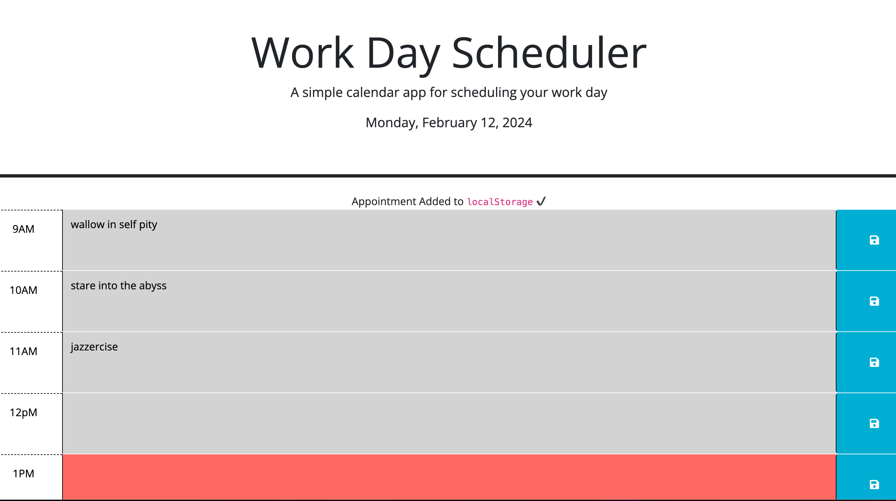

# WorkingScheduler
a schedule to help set up your working day

## Usage

## Description

This is a working day scheduler that saves information into local storage once text is written inside the time blocks. I had alot of trouble with some of the day.js format, it took me a while to get the date to pop out on the header of the page, but i also learned how javascript sends information to a website and how the data gets saved in local storage as well as figuring out how to be able to save the data. 

## Installation
Using javascript and HTML to create a working scheduler and to highlight the current time when a someone uses the scheduler with the use of day.js to help with formatting, and jQueries. 

